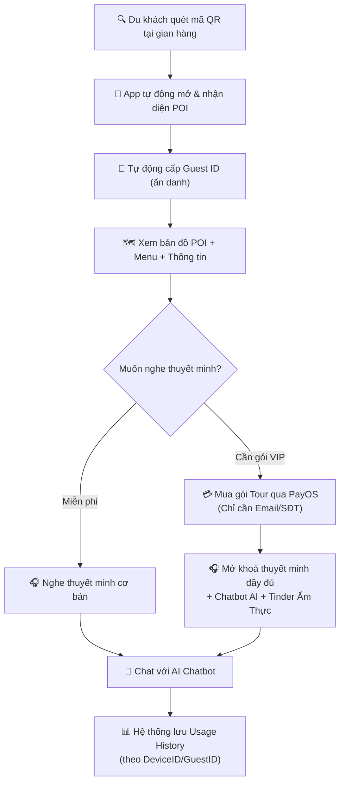

# Hệ Thống Thuyết Minh Đa Ngôn Ngữ cho Phố Ẩm Thực Vĩnh Khánh

## 📋 Thông Tin Đồ Án

| Thông Tin | Chi Tiết |
|-----------|---------|
| **Tên đồ án** | Hệ thống thuyết minh đa ngôn ngữ cho phố ẩm thực Vĩnh Khánh |
| **Thành viên 1** | Nguyễn Thùy Ánh Minh (3123411189) |
| **Thành viên 2** | Dương Anh Kiệt (3123411169) |
| **Loại dự án** | Web + Mobile Application System |

---

## 🎯 Tổng Quan

### Mục Tiêu & Bài Toán

Dự án **FoodTour POI** là một hệ thống thuyết minh thông minh dành cho khách du lịch nước ngoài và trong nước, nhằm cung cấp thông tin chi tiết về các gian hàng và món ăn trong phố ẩm thực Vĩnh Khánh.

#### Giải pháp chính:

- **Tự động phát thuyết minh**: Khi du khách vào phạm vi bán kính GPS của gian hàng, hệ thống tự động phát thuyết minh nghe
- **Đa ngôn ngữ**: Hỗ trợ dịch thuật và tổng hợp tiếng nói qua Azure Translator & Speech
- **AI Chatbot**: Tư vấn các món ăn và giải đáp thắc mắc thông qua Groq AI
- **Gói dịch vụ linh hoạt**: Người dùng có thể đăng ký các gói dịch vụ khác nhau (Basic, Premium, VIP)
- **Thanh toán trực tuyến**: Tích hợp PayOS cho thanh toán gói dịch vụ

#### Công nghệ chính:
- **GPS Positioning** + **Text-to-Speech (TTS)** + **Artificial Intelligence (Chatbot)**
- Tự động hóa hướng dẫn, giới thiệu lịch sử và tư vấn món ăn theo thời gian thực

---

## 🛠️ Công Nghệ Sử Dụng

### Frontend

| Công Nghệ | Mục Đích | Phiên Bản |
|----------|---------|---------|
| **.NET MAUI 9** | App di động (Android) cho người dùng | 9.0 |
| **Blazor Server** | Admin Dashboard quản trị hệ thống | .NET 8 |
| **MudBlazor** | UI Component Library cho Blazor | Latest |

### Backend

| Công Nghệ | Mục Đích | Phiên Bản |
|----------|---------|---------|
| **ASP.NET Core** | REST API Server | 8.0 |
| **Entity Framework Core** | ORM - Truy cập Database | 8.0 |
| **JWT Authentication** | Xác thực Token | Standard |

### Database

| Công Nghệ | Mục Đích | Phiên Bản |
|----------|---------|---------|
| **MySQL Server** | Lưu trữ dữ liệu chính | 8.0+ |
| **MySQL Workbench** | Quản lý Database GUI | Latest |

### Third-party APIs & Services

| Dịch vụ | Chức năng | Endpoint |
|--------|---------|---------|
| **Azure Speech Services** | Tổng hợp tiếng nói (Text-to-Speech) | Cloud Azure |
| **Azure Translator** | Dịch thuật đa ngôn ngữ | https://api.cognitive.microsofttranslator.com/ |
| **Groq AI** | Chatbot AI tư vấn | https://api.groq.com |
| **PayOS** | Gateway thanh toán | https://business.payos.vn |
| **QRCoder** | Sinh QR code PNG tự động cho gian hàng | NuGet (offline, no external API) |

### Development Tools

| Tool | Mục Đích |
|------|---------|
| **Visual Studio 2022 17.9+** | IDE chính cho phát triển |
| **.NET SDK 9.0** | Runtime cho MAUI App |
| **.NET SDK 8.0** | Runtime cho Backend & Admin |
| **Git** | Version Control |
| **Android SDK** | Build Android App (thông qua VS Installer) |
| **Android Emulator** | Testing App trên máy tính |

---

## 🏗️ Kiến Trúc Hệ Thống & Tính Năng Chính

### Sơ Đồ Cấu Trúc Hệ Thống

```
┌─────────────────────────────────────────────────────────────┐
│                     FoodTour POI System                      │
└─────────────────────────────────────────────────────────────┘
                              │
        ┌─────────────────────┼─────────────────────┐
        │                     │                     │
    ┌───▼────┐          ┌────▼────┐          ┌────▼─────┐
    │ Android │          │  Admin   │          │  Backend  │
    │  MAUI   │          │ Blazor   │          │  ASP.NET  │
    │  App    │          │ Server   │          │   Core    │
    └───┬────┘          └────┬────┘          └────┬─────┘
        │                    │                    │
        └────────────────────┼────────────────────┘
                             │
                    ┌────────▼────────┐
                    │   REST API      │
                    │   (Swagger)     │
                    └────────┬────────┘
                             │
            ┌────────────────┼────────────────┐
            │                │                │
        ┌───▼──┐    ┌──────▼──────┐    ┌──────▼──────┐
        │MySQL │    │Azure Services│    │PayOS & Groq │
        │ (DB) │    │(Speech, TTS) │    │(Payment,AI) │
        └──────┘    └──────────────┘    └─────────────┘
```

### Các Module Chính

#### 1. **Backend API (ASP.NET Core 8)**
- **Mục đích**: Xử lý business logic, quản lý dữ liệu, xác thực người dùng
- **Tính năng chính**:
  - REST API với Swagger Documentation
  - JWT Authentication & Authorization
  - Quản lý POI (Points of Interest), Shops, Sellers
  - Quản lý Service Packages & Subscriptions
  - Quản lý Menu Items & Food Categories
  - Thống kê đơn hàng & Reviews
  - Tích hợp Azure Speech, Translator, Groq AI, PayOS
- **Port**: `http://localhost:5279`

#### 2. **Admin Dashboard (Blazor Server .NET 8)**
- **Mục đích**: Giao diện quản trị dành cho người quản lý hệ thống
- **Tính năng chính**:
  - Quản lý Sellers (Chủ quán)
  - Quản lý Shops (Gian hàng)
  - Quản lý POI & Translations (Dữ liệu thuyết minh)
  - Quản lý Service Packages
  - Xem thống kê đơn hàng & doanh thu
  - Quản lý Users, Roles & Permissions
  - Xem Usage History của khách tham quan
- **Port**: `http://localhost:5231`
- **Đăng nhập**: admin@foodstreet.vn / Admin@1234

#### 3. **Mobile App (Android - .NET MAUI 9)**
- **Mục đích**: Ứng dụng di động cho khách du lịch tham quan phố ẩm thực
- **Mô hình truy cập**: **Guest Access** - Không cần đăng ký tài khoản, quét QR để truy cập nhanh
- **Tính năng chính**:
  - 📷 **Scan QR FAB** — Nút tròn nổi (Floating Action Button) màu cam ở giữa Bottom Navigation, bấm ngay là mở camera quét mã
  - 👤 **Guest Access** tự động (không cần tạo tài khoản)
  - 🗺️ Xem bản đồ POI (Google Maps/Leaflet)
  - 📍 Định vị GPS tự động phát thuyết minh
  - 🎧 Nghe thuyết minh đa ngôn ngữ (yêu cầu gói Tour)
  - 🤖 **Floating Chatbot Bubble** — Biểu tượng chatbot nhỏ nổi góc dưới phải mọi trang chính (Home, Explore, TourPlan, Profile), chạm vào để chat AI
  - 📋 Xem Menu & Reviews của cửa hàng
  - 💳 Đăng ký Service Packages (hỗ trợ Guest qua DeviceId)
  - 📊 Lịch sử sử dụng dịch vụ (theo DeviceID/GuestID)
- **Nền tảng**: Android (có thể mở rộng iOS thêm)

##### Quy Trình Sử Dụng (Guest Access Flow)



#### 4. **Dịch vụ Ngoài (External Services)**

| Dịch vụ | Chức năng | Tích hợp |
|--------|---------|---------|
| **Azure Speech** | Chuyển Text → Tiếng nói (TTS) | Backend API |
| **Azure Translator** | Dịch nội dung & Tiếng nói | Backend API |
| **Groq AI** | Chatbot tư vấn thông minh | Mobile App & Backend |
| **PayOS** | Gateway thanh toán dịch vụ | Backend & Admin |

---

## 🗄️ Cấu Trúc Cơ Sở Dữ Liệu

### Bảng Chính (13 bảng)

```
Database: poi_foodtour
├── users                  ← Tài khoản người dùng
├── roles                  ← Vai trò (ADMIN, OWNER, USER)
├── subscriptions          ← Đơn đăng ký dịch vụ
├── servicepackages        ← Gói dịch vụ (Basic, Premium, VIP)
├── sellers                ← Chủ quán
├── shops                  ← Gian hàng (+ QrCodeUrl từ migration AddQrCodeUrlToShop)
├── pois                   ← Điểm thuyết minh (Points of Interest)
├── poitranslations        ← Bản dịch & Nội dung thuyết minh
├── categories             ← Loại menu/món ăn
├── menuitems              ← Các món ăn
├── menus                  ← Menu của cửa hàng
├── orders                 ← Đơn hàng
├── reviews                ← Đánh giá & Bình luận
└── usagehistories         ← Lịch sử sử dụng dịch vụ
```

### Mối Quan Hệ Chính

```
users (1) ──── (M) subscriptions ──── (1) servicepackages
        │
        └──── (M) orders ──── (M) menuitems
        │
        └──── (M) reviews ──── (M) menuitems

sellers (1) ──── (M) shops ──── (M) pois ──── (M) poitranslations

shops (1) ──── (M) menus ──── (M) menuitems ──── (1) categories
```

---

## 📁 Cấu Trúc Thư Mục Dự Án

```
foodtour/
├── backend/
│   └── PoiApi/                          ← Backend API (.NET 8)
│       ├── PoiApi.csproj
│       ├── appsettings.json             ← Cấu hình (API Keys, DB Connection)
│       ├── Program.cs                   ← Startup Configuration
│       ├── Controllers/                 ← REST API Endpoints
│       ├── Models/                      ← Entity Models (Users, POIs, Orders...)
│       ├── Services/                    ← Business Logic (Auth, Payment, AI...)
│       ├── Data/                        ← DbContext & Migrations
│       └── Middleware/                  ← JWT, Error Handling
│
├── front-end/
│   ├── foodstreet-admin/                ← Admin Dashboard (Blazor .NET 8)
│   │   ├── foodstreet-admin.slnx
│   │   ├── appsettings.json
│   │   ├── Pages/                       ← Blazor Pages (Sellers, Shops, POI...)
│   │   ├── Components/                  ← Reusable UI Components
│   │   ├── Services/                    ← API Client Services
│   │   └── wwwroot/                     ← Static Files (CSS, JS, Images)
│   │
│   └── App-user/AppUser/                ← Mobile App (.NET MAUI 9)
│       ├── AppUser.slnx
│       ├── appsettings.json
│       ├── Views/                       ← XAML Pages (Map, Chat, Orders...)
│       ├── ViewModels/                  ← MVVM ViewModels
│       ├── Services/                    ← API Client, GPS, Audio Services
│       ├── Resources/                   ← Images, Fonts, Strings
│       └── Platforms/                   ← Platform-specific code (Android, iOS)
│
└── POI_FoodTour.sql                     ← Database Script (Create Tables + Sample Data)
    ├── CREATE DATABASE
    ├── CREATE TABLES (13 bảng)
    ├── INSERT DATA (Roles, Service Packages, Sample POI, Shops...)
    └── CREATE INDEXES & TRIGGERS
```

---

## 🚀 Hướng Dẫn Cài Đặt Nhanh

### Yêu Cầu Hệ Thống

```
❌ Windows 10/11 (64-bit) hoặc macOS 12+
✅ Processor: Intel Core i5 hoặc tương đương
✅ RAM: Tối thiểu 8GB (Khuyến nghị 16GB)
✅ Disk Space: 20GB (để cài Visual Studio, SDKs, Android SDK)
```

### Yêu Cầu Phần Mềm

| Phần Mềm | Phiên Bản | Bắt Buộc |
|---------|---------|---------|
| Visual Studio 2022 | 17.9+ | ✅ Bắt buộc |
| .NET SDK 9.0 (MAUI) | 9.0 | ✅ Bắt buộc |
| .NET SDK 8.0 (Backend/Admin) | 8.0 | ✅ Bắt buộc |
| MySQL Server | 8.0+ | ✅ Bắt buộc |
| MySQL Workbench | Latest | ⭐ Tùy chọn |
| Git | Any | ✅ Bắt buộc |
| Android SDK | (via VS Installer) | ✅ Cho MAUI |
| Android Emulator | (via VS Installer) | ⭐ Tùy chọn |

### Các Bước Cài Đặt Chi Tiết

#### **Bước 1: Cài Đặt Cơ Sở Dữ Liệu MySQL**

**1.1 Tạo database và import dữ liệu:**

```bash
# Cách 1: Dùng MySQL Command Line
mysql -u root -p < đường_dẫn_đến/POI_FoodTour.sql
```

Hoặc trong **MySQL Workbench**:
1. Mở menu `File → Open SQL Script`
2. Chọn file `POI_FoodTour.sql` trong thư mục gốc dự án
3. Nhấn nút `Execute` (⚡)

**1.2 Xác nhận database đã được tạo:**

```sql
SHOW DATABASES;
-- Kết quả phải có: poi_foodtour

USE poi_foodtour;
SHOW TABLES;
-- Kết quả mong đợi: 13 bảng (categories, menuitems, menus, orders, pois, 
-- poitranslations, reviews, roles, servicepackages, shops, 
-- subscriptions, usagehistories, users)
```

**📌 Lưu ý:**
- File SQL đã bao gồm dữ liệu mẫu
- Tài khoản admin mặc định: `admin@foodstreet.vn`
- Mật khẩu admin mặc định: `Admin@1234`

---

#### **Bước 2: Cấu Hình & Khởi Chạy Backend API**

**2.1 Mở dự án:**

Mở file `backend/PoiApi.slnx` bằng **Visual Studio 2022**

**2.2 Cấu hình `appsettings.json`:**

Mở file `backend/PoiApi/appsettings.json` và cập nhật các giá trị:

```json
{
  "ConnectionStrings": {
    "MySql": "server=localhost;port=3306;database=POI_FoodTour;user=root;password=MẬT_KHẨU_MYSQL_CỦA_BẠN"
  },
  "Jwt": {
    "Key": "THIS_IS_A_SUPER_SECRET_KEY_123456",
    "Issuer": "PoiApi",
    "Audience": "PoiApiClient"
  },
  "Azure": {
    "SpeechKey": "KEY_AZURE_SPEECH_CỦA_BẠN",
    "SpeechRegion": "southeastasia",
    "TranslatorKey": "KEY_AZURE_TRANSLATOR_CỦA_BẠN",
    "TranslatorRegion": "global",
    "TranslatorEndpoint": "https://api.cognitive.microsofttranslator.com/"
  },
  "PayOS": {
    "ClientId": "CLIENT_ID_PAYOS_CỦA_BẠN",
    "ApiKey": "API_KEY_PAYOS_CỦA_BẠN",
    "ChecksumKey": "CHECKSUM_KEY_PAYOS_CỦA_BẠN"
  },
  "Groq": {
    "ApiKey": "API_KEY_GROQ_CỦA_BẠN"
  },
  "App": {
    "BaseUrl": "http://localhost:5042"
  }
}
```

**⚠️ CẢNH BÁO:** Không bỏ qua phần cấu hình này! Nếu thiếu API key thực, các tính năng sau sẽ không hoạt động:

| Tính năng | API cần |
|----------|--------|
| Text-to-Speech & Dịch thuật | Azure Speech + Translator |
| Thanh toán dịch vụ | PayOS |
| Chatbot AI tư vấn | Groq |

**Hướng dẫn lấy API Keys:**

| Service | Link Đăng Ký |
|---------|-------------|
| Azure Speech + Translator | https://portal.azure.com → Tạo resource "Speech service" & "Translator" |
| PayOS | https://business.payos.vn → Đăng nhập → Developer → API Keys |
| Groq | https://console.groq.com → Dashboard → API Keys |

**2.3 Khởi chạy Backend:**

Trong Visual Studio:
- Đặt project `PoiApi` làm **Startup Project**
- Nhấn `F5` hoặc `Ctrl+F5`

Hoặc dùng terminal:

```bash
cd backend/PoiApi
dotnet run
```

**✅ Backend khởi chạy thành công khi:**
- Trình duyệt tự mở: `http://localhost:5279/swagger`
- Có thể xem Swagger UI với tất cả các endpoint

**📌 Lưu ý:** Khi khởi chạy lần đầu, hệ thống tự động:
- Chạy Database Migration
- Seed dữ liệu Roles (ADMIN, OWNER, USER)
- Seed bảng Service Packages (Basic, Premium, VIP)

---

#### **Bước 3: Cấu Hình & Khởi Chạy Admin Dashboard**

**3.1 Mở dự án:**

Mở file `front-end/foodstreet-admin/foodstreet-admin.slnx` bằng **Visual Studio 2022**

**3.2 Cấu hình URL Backend:**

Mở file `front-end/foodstreet-admin/foodstreet-admin/appsettings.json`:

```json
{
    "ApiBaseUrl": "http://localhost:5279/api/"
}
```

**⚠️ QUAN TRỌNG:**
- Port `5279` phải khớp với port Backend API đang chạy
- Kiểm tra trong `Properties/launchSettings.json` của `PoiApi` nếu cần

**3.3 Khởi chạy:**

Đặt project `foodstreet-admin` làm **Startup Project**, nhấn `F5`

Hoặc dùng terminal:

```bash
cd front-end/foodstreet-admin/foodstreet-admin
dotnet run
```

**✅ Admin Dashboard truy cập tại:** `http://localhost:5231` (hoặc port được assign)

**3.4 Đăng nhập Admin:**

| Thông tin | Giá trị |
|----------|--------|
| Email | admin@foodstreet.vn |
| Mật khẩu | Admin@1234 |

---

#### **Bước 4: Build & Cài Đặt App Người Dùng (Android)**

**4.1 Yêu cầu thêm cho MAUI Android:**

- ✅ Cài Android SDK thông qua **Visual Studio Installer**
- ✅ Kết nối điện thoại Android (bật Developer Options + USB Debugging)
- ✅ Hoặc cài **Android Emulator** từ Visual Studio

**4.2 Mở dự án:**

Mở file `front-end/App-user/AppUser/AppUser.slnx` bằng **Visual Studio 2022**

**4.3 Cấu hình URL Backend:**

Tìm file cấu hình API trong `front-end/App-user/AppUser/AppUser/Services/` và cập nhật:

```csharp
// Nếu chạy trên emulator
private const string BaseUrl = "http://10.0.2.2:5279/api/";

// Nếu chạy trên thiết bị thật (cùng mạng WiFi)
private const string BaseUrl = "http://192.168.x.x:5279/api/";
// Thay 192.168.x.x bằng IP thật của máy tính chạy backend
```

**⚠️ QUAN TRỌNG - Kết nối thiết bị thật:**

- ✅ Thiết bị Android và máy tính phải cùng mạng WiFi
- ✅ Backend API phải lắng nghe trên `0.0.0.0` (không phải chỉ `localhost`)
- ✅ Kiểm tra Firewall Windows — cho phép port `5279`

**4.4 Build và Deploy:**

Trong Visual Studio:
1. Chọn thiết bị Android mục tiêu ở thanh toolbar
2. Nhấn `F5` để Build và Deploy

Hoặc build file APK:

```bash
cd front-end/App-user/AppUser/AppUser
dotnet publish -f net9.0-android -c Release
```

File APK sẽ xuất hiện trong: `bin/Release/net9.0-android/publish/`

---

#### **Bước 5: Kiểm Tra Toàn Hệ Thống**

**✅ Checklist kiểm tra:**

- [ ] MySQL đang chạy và database `poi_foodtour` tồn tại
- [ ] Backend API chạy thành công tại `http://localhost:5279/swagger`
- [ ] Truy cập `/swagger` → Thử `GET /api/poi` → Nhận về danh sách POI
- [ ] Admin Dashboard truy cập được tại `http://localhost:5231`
- [ ] Đăng nhập Admin thành công
- [ ] Xem được danh sách Sellers và Shops
- [ ] App Android cài được trên thiết bị / emulator
- [ ] Đăng ký tài khoản người dùng mới trên App
- [ ] Xem bản đồ POI trên App

---

## 🌟 Tính Năng Nổi Bật

### Cho Người Dùng (Mobile App)

| Tính năng | Mô tả |
|----------|-------|
| 🗺️ **Bản đồ POI** | Xem tất cả các gian hàng & điểm thuyết minh trên bản đồ |
| 📍 **Định vị GPS** | Tự động phát thuyết minh khi vào phạm vi cửa hàng |
| 🎧 **Thuyết minh Audio** | Nghe hướng dẫn bằng tiếng nói tự động (TTS) |
| 🌐 **Đa ngôn ngữ** | Hỗ trợ dịch thuật sang nhiều ngôn ngữ |
| 🤖 **Chatbot AI** | Chat tư vấn với AI về các món ăn |
| 🍽️ **Menu & Reviews** | Xem menu chi tiết và đánh giá của khách |
| 💳 **Thanh toán** | Đăng ký dịch vụ với PayOS |
| 📊 **Lịch sử sử dụng** | Xem lịch sử tất cả các dịch vụ đã sử dụng |

### Cho Quản Trị Viên (Admin Dashboard)

| Tính năng | Mô tả |
|----------|-------|
| 👤 **Quản lý Sellers** | Thêm/sửa/xóa chủ quán và phân quyền |
| 🏪 **Quản lý Shops** | Quản lý gian hàng, vị trí GPS, thông tin liên hệ |
| 🔲 **Mã QR Gian Hàng** | Xem, Tải PNG và Tạo lại QR code tự động cho từng gian hàng |
| 📢 **Quản lý POI** | Tạo nội dung thuyết minh, dịch thuật, âm thanh |
| 📦 **Quản lý Service Packages** | Tạo gói dịch vụ (Basic, Premium, VIP) |
| 📈 **Thống kê & Reports** | Xem doanh thu, số lượng người dùng, tỷ lệ chuyển đổi |
| 🔐 **Quản lý Roles & Permissions** | Phân quyền chi tiết cho các user |
| 📝 **Quản lý Users** | Xem, sửa, khóa tài khoản người dùng |

---

## 🎓 Kỹ Thuật Chính

### Backend Architecture Pattern

```
MVC Pattern (Model-View-Controller)
├── Models Layer
│   ├── Entities (User, POI, Shop, Order...)
│   └── DTOs (Data Transfer Objects)
├── Service Layer (Business Logic)
│   ├── AuthService (JWT, Login)
│   ├── POIService (CRUD POI)
│   ├── OrderService (Quản lý đơn hàng)
│   ├── PaymentService (Tích hợp PayOS)
│   ├── SpeechService (Azure TTS)
│   ├── TranslationService (Azure Translator)
│   ├── ChatService (Groq AI)
│   ├── GuestTokenService (JWT ẩn danh cho khách)
│   └── QrCodeService (Sinh QR PNG cho gian hàng)  ← MỚI
├── Repository Layer (Data Access)
│   └── DbContext (Entity Framework)
└── Controller Layer (API Endpoints)
    ├── UsersController
    ├── POIController
    ├── ShopsController
    ├── OrdersController
    └── ...
```

### Frontend Architecture Pattern

```
MVVM Pattern (Model-View-ViewModel)
├── Views (UI Pages - XAML/Razor)
├── ViewModels (Logic & Data Binding)
├── Models (Data Models)
└── Services (API Communication, GPS, Audio...)
```

---

## 📊 Quy Trình Sử Dụng Hệ Thống

```
┌─────────────────────────────────────────────────────────┐
│  Du Khách tải App & Tạo Tài Khoản                      │
└────────────────────┬────────────────────────────────────┘
                     │
        ┌────────────▼──────────────┐
        │  Đăng ký Service Package  │
        │  (Basic/Premium/VIP)      │
        │  Thanh toán qua PayOS     │
        └────────────┬──────────────┘
                     │
        ┌────────────▼──────────────┐
        │ Mở App & Bật GPS          │
        │ Xem Bản đồ POI            │
        └────────────┬──────────────┘
                     │
        ┌────────────▼──────────────┐
        │ Đi tới gian hàng          │
        │ (Trong phạm vi GPS)       │
        └────────────┬──────────────┘
                     │
        ┌────────────▼──────────────┐
        │ App tự động phát          │
        │ Thuyết minh Audio         │
        │ (Dịch theo ngôn ngữ)      │
        └────────────┬──────────────┘
                     │
        ┌────────────▼──────────────┐
        │ Du khách chat với         │
        │ Chatbot AI để tư vấn      │
        │ Xem menu & giá            │
        │ Đọc Reviews               │
        └────────────┬──────────────┘
                     │
        ┌────────────▼──────────────┐
        │ Đặt hàng (nếu muốn)       │
        └────────────┬──────────────┘
                     │
        ┌────────────▼──────────────┐
        │ Hệ thống lưu Usage        │
        │ History & Analytics       │
        └───────────────────────────┘
```

---

## 🔄 Quy Trình Quản Trị (Admin)

```
Admin Đăng Nhập
     │
     ├─→ Quản lý Sellers & Shops
     │   ├─ Thêm/Sửa/Xóa chủ quán
     │   └─ Cập nhật vị trí GPS, thông tin
     │
     ├─→ Quản lý POI (Points of Interest)
     │   ├─ Tạo nội dung thuyết minh
     │   ├─ Dịch sang nhiều ngôn ngữ (Azure Translator)
     │   └─ Tạo âm thanh (Azure Speech TTS)
     │
     ├─→ Quản lý Service Packages
     │   ├─ Tạo gói dịch vụ mới
     │   ├─ Đặt giá tiền
     │   └─ Điều chỉnh features từng gói
     │
     └─→ Xem Reports & Analytics
         ├─ Doanh thu theo tháng
         ├─ Số lượng người dùng hoạt động
         ├─ Tỷ lệ chuyển đổi (Conversion Rate)
         └─ Đánh giá từ khách hàng
```

---

## 🚀 Hướng Phát Triển Tương Lai

### Tính Năng Được Đề Xuất

| Tính năng | Mô tả | Ưu tiên |
|----------|-------|---------|
| 🎥 **Video Tour** | Thêm video hướng dẫn cho từng cửa hàng | ⭐⭐⭐ |
| 👥 **Social Sharing** | Chia sẻ đánh giá lên Social Media | ⭐⭐⭐ |
| 📊 **Advanced Analytics** | Dashboard phân tích chi tiết hơn | ⭐⭐ |
| 🌐 **Web Version** | Phiên bản web để book trước | ⭐⭐ |
| 💬 **Live Chat Support** | Hỗ trợ khách hàng trực tiếp | ⭐⭐ |
| 🎁 **Loyalty Program** | Chương trình khách hàng thân thiết | ⭐ |
| 📱 **iOS Version** | Mở rộng sang nền tảng iOS | ⭐ |
| 🤖 **Advanced AI** | Chatbot AI học hỏi từ tương tác | ⭐ |

### Cải Tiến Hiệu Năng

- [ ] Caching (Redis) cho dữ liệu POI thường xuyên truy cập
- [ ] Lazy Loading hình ảnh trong App
- [ ] Compression audio files
- [ ] CDN cho static content
- [ ] Database Indexing tối ưu

### Nâng Cấp Bảo Mật

- [ ] Two-Factor Authentication (2FA)
- [ ] End-to-End Encryption cho Chat
- [ ] Rate Limiting trên API endpoints
- [ ] Regular Security Audits
- [ ] GDPR Compliance

---

## 📚 Tài Liệu Tham Khảo

### Documentations

- [Microsoft .NET Documentation](https://docs.microsoft.com/en-us/dotnet/)
- [ASP.NET Core Official Docs](https://docs.microsoft.com/en-us/aspnet/core/)
- [Entity Framework Core](https://docs.microsoft.com/en-us/ef/core/)
- [.NET MAUI Documentation](https://learn.microsoft.com/en-us/dotnet/maui/)
- [Blazor Documentation](https://docs.microsoft.com/en-us/aspnet/core/blazor/)
- [MudBlazor Components](https://mudblazor.com/)
- [Azure Speech Services](https://learn.microsoft.com/en-us/azure/cognitive-services/speech-service/)
- [PayOS API](https://payos.vn/docs)
- [Groq API](https://console.groq.com/docs)

### Lệnh Hữu Ích

```bash
# Kiểm tra phiên bản .NET
dotnet --version

# Tạo migration mới (Backend)
dotnet ef migrations add MigrationName

# Update database
dotnet ef database update

# Xem danh sách packages
dotnet list package

# Restore dependencies
dotnet restore

# Build project
dotnet build

# Publish for production
dotnet publish -c Release
```

---

## 👥 Thông Tin Liên Hệ & Support

| Thông tin | Chi tiết |
|-----------|---------|
| **Đồ án** | Hệ thống thuyết minh đa ngôn ngữ cho phố ẩm thực Vĩnh Khánh |
| **Thành viên 1** | Nguyễn Thùy Ánh Minh (3123411189) |
| **Thành viên 2** | Dương Anh Kiệt (3123411169) |
| **Repository** | [Link Git sẽ được cập nhật] |
| **Issues & Support** | Vui lòng tạo issue trên GitHub hoặc liên hệ qua email |

---

## ✅ Kết Luận

### Điểm Mạnh

✨ **Hệ thống thông minh** - Tự động phát thuyết minh dựa trên vị trí GPS
✨ **Đa ngôn ngữ** - Hỗ trợ dịch thuật tự động qua Azure
✨ **AI Chatbot** - Tư vấn thông minh qua Groq AI
✨ **Giao diện hiện đại** - Admin Dashboard & Mobile App thân thiện
✨ **Thanh toán an toàn** - Tích hợp PayOS cho giao dịch
✨ **Mở rộng dễ dàng** - Kiến trúc modular, dễ thêm tính năng mới

### Thách Thức & Giải Pháp

| Thách Thức | Giải Pháp |
|-----------|----------|
| Tốn chi phí Azure API | Tối ưu lượng gọi API, caching |
| Cần kết nối internet ổn định | Implement offline mode cơ bản |
| Định vị GPS kém trong nhà | Sử dụng Beacon/WiFi định vị |
| Dữ liệu Audio lớn | Compress audio, stream progressively |

### Tác Động & Ứng Dụng

🌟 **Cho Du Khách**: Trải nghiệm du lịch hiện đại, không cần hướng dẫn viên
🌟 **Cho Chủ Quán**: Tăng lượng khách, giảm chi phí hướng dẫn
🌟 **Cho Thành Phố**: Quảng bá văn hóa ẩm thực, thu hút du lịch
🌟 **Công Nghệ**: Ứng dụng thực tế của AI, IoT, Cloud Computing

---

## 📝 Lịch Sử Thay Đổi

### Phiên bản 1.2 — Tháng 4, 2026

#### 🔲 Tính năng mới: Hệ thống QR Code tự động cho Gian hàng Seller

**Backend:**
- Thêm NuGet **QRCoder 1.6.0** (cross-platform, không cần System.Drawing)
- Thêm field `QrCodeUrl` (nullable) vào model `Shop` + migration `AddQrCodeUrlToShop`
- Tạo **`QrCodeService`** (`Services/QrCodeService.cs`):
  - Sinh file PNG 240×240px màu cam (`#FF6B35`) — lưu vào `wwwroot/qr/shop-{id}-qr.png`
  - URL được mã hóa trong QR: `{App:BaseUrl}/poi/{shopId}` (deep link cho mobile app)
- Thêm cấu hình `App:BaseUrl` vào `appsettings.json`
- Cập nhật `ShopsController`:
  - Tự động sinh QR sau `POST /api/owner/shops` (CreateShop)
  - Tự động bổ sung QR sau `PUT /api/owner/shops/{id}` nếu chưa có
  - `GET /api/owner/shops/{id}/qr` — Lấy thông tin QR code
  - `POST /api/owner/shops/{id}/regenerate-qr` — Tạo lại QR code
  - `GET /api/owner/shops` — Thêm `qrCodeUrl` vào response

**Admin Frontend (Blazor):**
- Thêm `QrCodeUrl` vào `StoreModel.cs`
- Cập nhật **`MyStore.razor`**:
  - Nút 🔲 **Xem QR** (icon `QrCode2`) → mở QR Modal preview 240×240
  - Nút ⬇️ **Tải PNG** (icon `Download`) → download file PNG về máy
  - **QR Modal** hiển thị: ảnh QR, tên gian hàng, URL được mã hóa, nút Tạo lại / Tải PNG
- Thêm `RegenerateQrCodeAsync()` vào `StoreService.cs`
- Thêm JS helper `window.downloadFileFromUrl(url, fileName)` vào `leaflet-map.js`

---

### Phiên bản 1.1 — Tháng 4, 2026

#### 📱 Cải tiến UI Mobile App (MAUI)

**Bottom Navigation — Scan QR FAB:**
- Thay tab **Chatbot** ở giữa bằng **Floating Action Button (FAB)** hình tròn màu cam
- FAB có icon camera/QR, nhấn vào mở trực tiếp camera quét mã
- Sử dụng `ScanQrPlaceholderPage` làm route trung gian kích hoạt camera
- Xóa banner "Quét mã QR tại gian hàng" cũ trên `HomePage`

**Floating Chatbot Bubble:**
- Chatbot chuyển từ tab điều hướng sang **Floating Bubble** góc dưới phải
- Hiển thị trên 4 trang: `HomePage`, `POIListPage`, `TourPlanPage`, `ProfilePage`
- Thiết kế: hình tròn gradient cam, shadow, icon 🤖
- Chạm vào bubble → navigate đến route `chat`
- Kỹ thuật: bọc mỗi trang bằng `Grid` root để hỗ trợ overlay `HorizontalOptions="End", VerticalOptions="End"`

---

**Tài liệu này được cập nhật lần cuối: Tháng 4, 2026**
**Phiên bản: 1.2**
