# Phụ lục UML cho báo cáo đồ án C#

Tài liệu này bám theo codebase hiện tại của dự án FoodStreet:
- Backend: `backend/PoiApi`
- Mobile: `front-end/App-user/AppUser/AppUser`
- Web Portal: `front-end/foodstreet-admin/foodstreet-admin`

Mỗi use case gồm 3 phần:
- Use Case specification
- Sequence Diagram
- Activity Diagram

---

## UC01 - Guest truy cập ứng dụng và nhận Guest Token

### Use Case Specification
- Mã use case: UC01
- Tác nhân chính: Guest
- Mục tiêu: Cho phép người dùng dùng app không cần đăng ký tài khoản
- Tiền điều kiện: App đã cài đặt, thiết bị có internet
- Hậu điều kiện: Guest token được lưu, app truy cập API theo quyền guest
- Luồng chính:
  1. Guest mở app
  2. App gọi `GuestService.InitializeAsync()`
  3. App gửi `POST /api/auth/guest-token`
  4. Backend tạo JWT role `GUEST`
  5. App lưu `guest_id` và `guest_token` vào SecureStorage
- Luồng thay thế:
  - API lỗi: app ghi log, chạy chế độ giới hạn

### Sequence Diagram
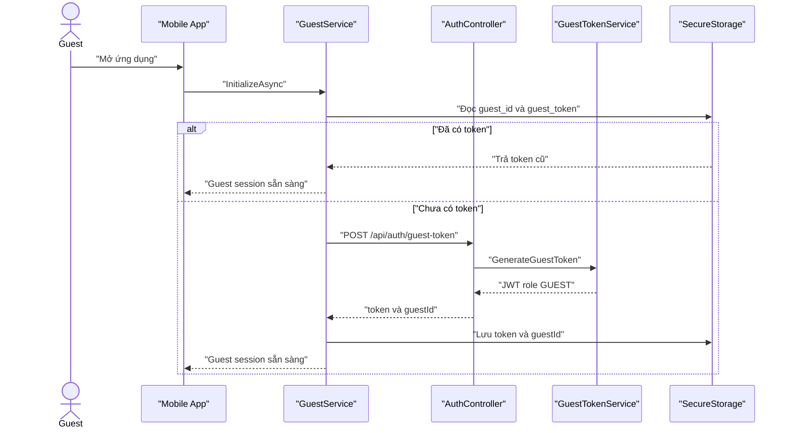
```mermaid
sequenceDiagram
    actor G as Guest
    participant M as "Mobile App"
    participant GS as "GuestService"
    participant API as "AuthController"
    participant GTS as "GuestTokenService"
    participant SS as "SecureStorage"

    G->>M: "Mở ứng dụng"
    M->>GS: "InitializeAsync"
    GS->>SS: "Đọc guest_id và guest_token"
    alt "Đã có token"
        SS-->>GS: "Trả token cũ"
        GS-->>M: "Guest session sẵn sàng"
    else "Chưa có token"
        GS->>API: "POST /api/auth/guest-token"
        API->>GTS: "GenerateGuestToken"
        GTS-->>API: "JWT role GUEST"
        API-->>GS: "token và guestId"
        GS->>SS: "Lưu token và guestId"
        GS-->>M: "Guest session sẵn sàng"
    end
```

### Activity Diagram
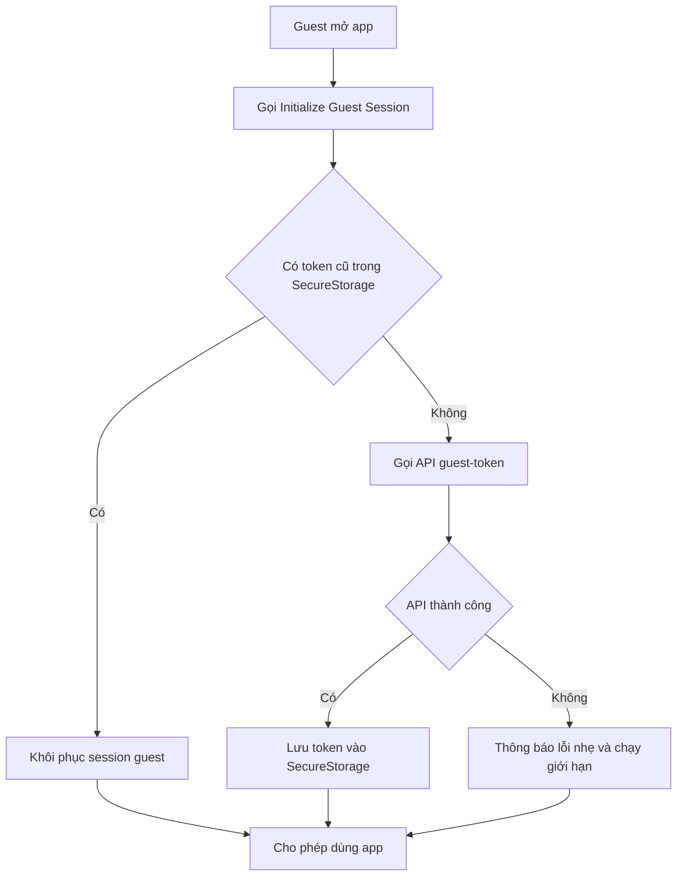
```mermaid
flowchart TD
    A["Guest mở app"] --> B["Gọi Initialize Guest Session"]
    B --> C{"Có token cũ trong SecureStorage"}
    C -- "Có" --> D["Khôi phục session guest"]
    C -- "Không" --> E["Gọi API guest-token"]
    E --> F{"API thành công"}
    F -- "Có" --> G["Lưu token vào SecureStorage"]
    F -- "Không" --> H["Thông báo lỗi nhẹ và chạy giới hạn"]
    D --> I["Cho phép dùng app"]
    G --> I
    H --> I
```

---

## UC02 - Đăng nhập và phân quyền người dùng

### Use Case Specification
- Mã use case: UC02
- Tác nhân chính: User, Admin, Owner
- Mục tiêu: Xác thực tài khoản và cấp JWT theo role
- Tiền điều kiện: Tài khoản tồn tại, chưa bị khóa
- Hậu điều kiện: Client giữ JWT, truy cập API theo quyền role
- Luồng chính:
  1. Người dùng nhập email/password
  2. App/Web gửi `POST /api/auth/login`
  3. Backend kiểm tra mật khẩu BCrypt
  4. Backend trả token + role
  5. Client gắn bearer token cho request sau
- Luồng thay thế:
  - Sai mật khẩu
  - Tài khoản `IsActive = false`

### Sequence Diagram
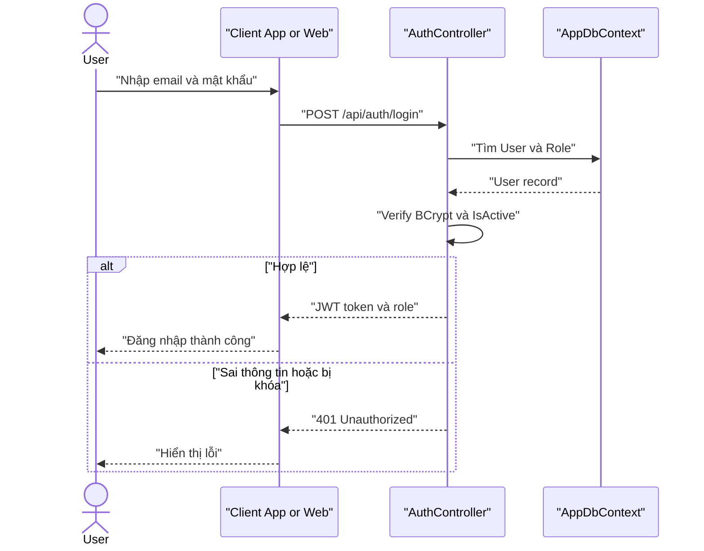
```mermaid
sequenceDiagram
    actor U as User
    participant C as "Client App or Web"
    participant API as "AuthController"
    participant DB as "AppDbContext"

    U->>C: "Nhập email và mật khẩu"
    C->>API: "POST /api/auth/login"
    API->>DB: "Tìm User và Role"
    DB-->>API: "User record"
    API->>API: "Verify BCrypt và IsActive"
    alt "Hợp lệ"
        API-->>C: "JWT token và role"
        C-->>U: "Đăng nhập thành công"
    else "Sai thông tin hoặc bị khóa"
        API-->>C: "401 Unauthorized"
        C-->>U: "Hiển thị lỗi"
    end
```

### Activity Diagram
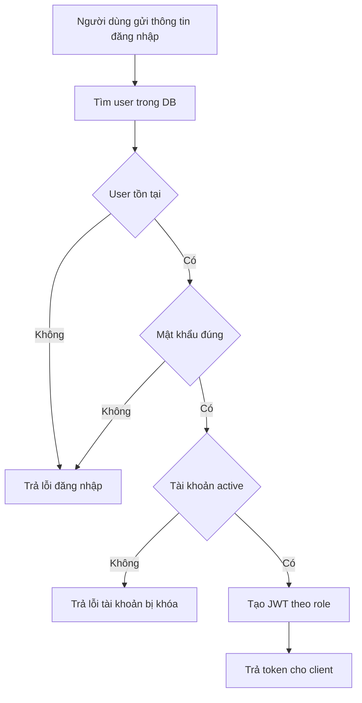
```mermaid
flowchart TD
    A["Người dùng gửi thông tin đăng nhập"] --> B["Tìm user trong DB"]
    B --> C{"User tồn tại"}
    C -- "Không" --> Z["Trả lỗi đăng nhập"]
    C -- "Có" --> D{"Mật khẩu đúng"}
    D -- "Không" --> Z
    D -- "Có" --> E{"Tài khoản active"}
    E -- "Không" --> Y["Trả lỗi tài khoản bị khóa"]
    E -- "Có" --> F["Tạo JWT theo role"]
    F --> G["Trả token cho client"]
```

---

## UC03 - Xem danh sách và chi tiết POI đa ngôn ngữ

### Use Case Specification
- Mã use case: UC03
- Tác nhân chính: Guest hoặc User
- Mục tiêu: Xem POI list/detail theo ngôn ngữ
- Tiền điều kiện: API hoạt động
- Hậu điều kiện: Danh sách và chi tiết POI hiển thị đúng fallback ngôn ngữ
- Luồng chính:
  1. Client gọi `GET /api/app/pois?lang=xx`
  2. Backend lấy shop active + POI + translations
  3. Nếu thiếu bản dịch, backend gọi Azure Translator
  4. Client hiển thị list và map

### Sequence Diagram
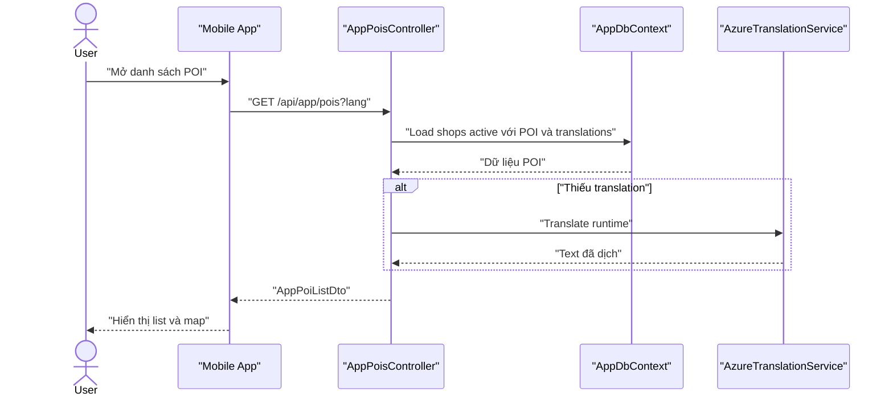
```mermaid
sequenceDiagram
    actor U as User
    participant M as "Mobile App"
    participant API as "AppPoisController"
    participant DB as "AppDbContext"
    participant TR as "AzureTranslationService"

    U->>M: "Mở danh sách POI"
    M->>API: "GET /api/app/pois?lang"
    API->>DB: "Load shops active với POI và translations"
    DB-->>API: "Dữ liệu POI"
    alt "Thiếu translation"
        API->>TR: "Translate runtime"
        TR-->>API: "Text đã dịch"
    end
    API-->>M: "AppPoiListDto"
    M-->>U: "Hiển thị list và map"
```

### Activity Diagram
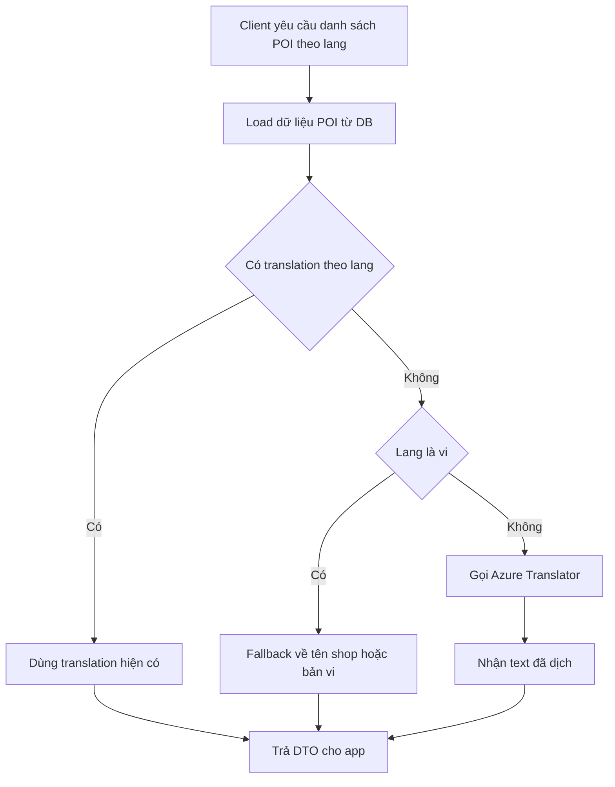
```mermaid
flowchart TD
    A["Client yêu cầu danh sách POI theo lang"] --> B["Load dữ liệu POI từ DB"]
    B --> C{"Có translation theo lang"}
    C -- "Có" --> D["Dùng translation hiện có"]
    C -- "Không" --> E{"Lang là vi"}
    E -- "Có" --> F["Fallback về tên shop hoặc bản vi"]
    E -- "Không" --> G["Gọi Azure Translator"]
    G --> H["Nhận text đã dịch"]
    D --> I["Trả DTO cho app"]
    F --> I
    H --> I
```

---

## UC04 - Nghe audio POI và gửi đánh giá

### Use Case Specification
- Mã use case: UC04
- Tác nhân chính: User hoặc Guest có quyền audio
- Mục tiêu: Phát audio guide và track usage
- Tiền điều kiện: Có audio URL, user có quyền
- Hậu điều kiện: Listen được ghi nhận, review có thể được gửi
- Luồng chính:
  1. Client gọi POI detail lấy `AudioUrl`
  2. App tải file audio về cache local
  3. Phát bằng MediaElement
  4. App gọi `POST /api/app/pois/{id}/listen`
  5. User gửi review qua `POST /api/app/pois/{id}/reviews`
- Luồng thay thế:
  - MediaElement fail, fallback qua WebView audio

### Sequence Diagram
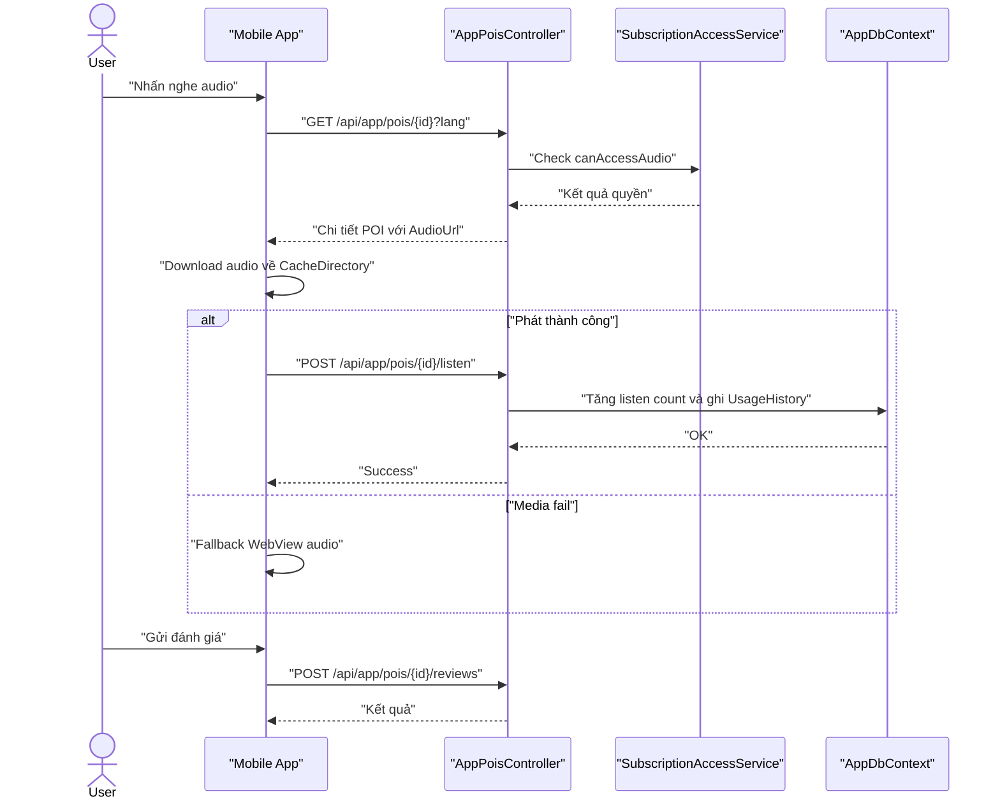
```mermaid
sequenceDiagram
    actor U as User
    participant M as "Mobile App"
    participant API as "AppPoisController"
    participant SUB as "SubscriptionAccessService"
    participant DB as "AppDbContext"

    U->>M: "Nhấn nghe audio"
    M->>API: "GET /api/app/pois/{id}?lang"
    API->>SUB: "Check canAccessAudio"
    SUB-->>API: "Kết quả quyền"
    API-->>M: "Chi tiết POI với AudioUrl"
    M->>M: "Download audio về CacheDirectory"
    alt "Phát thành công"
        M->>API: "POST /api/app/pois/{id}/listen"
        API->>DB: "Tăng listen count và ghi UsageHistory"
        DB-->>API: "OK"
        API-->>M: "Success"
    else "Media fail"
        M->>M: "Fallback WebView audio"
    end
    U->>M: "Gửi đánh giá"
    M->>API: "POST /api/app/pois/{id}/reviews"
    API-->>M: "Kết quả"
```

### Activity Diagram
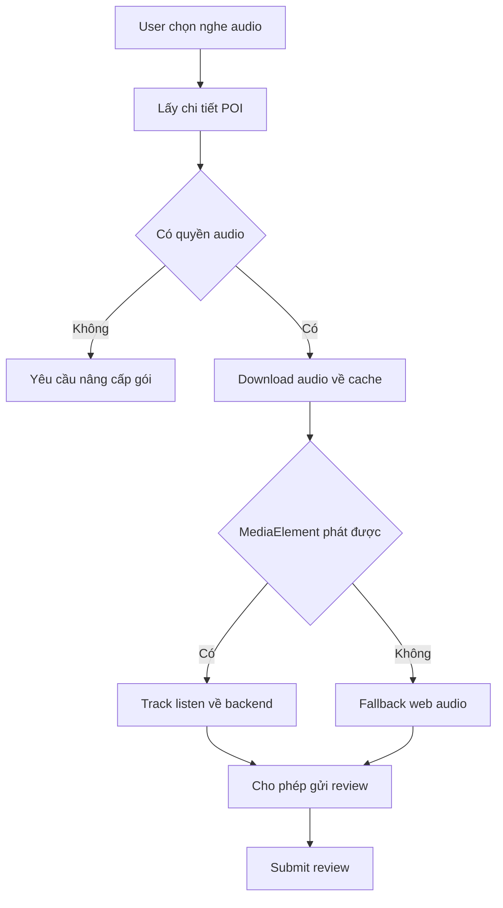
```mermaid
flowchart TD
    A["User chọn nghe audio"] --> B["Lấy chi tiết POI"]
    B --> C{"Có quyền audio"}
    C -- "Không" --> D["Yêu cầu nâng cấp gói"]
    C -- "Có" --> E["Download audio về cache"]
    E --> F{"MediaElement phát được"}
    F -- "Có" --> G["Track listen về backend"]
    F -- "Không" --> H["Fallback web audio"]
    G --> I["Cho phép gửi review"]
    H --> I
    I --> J["Submit review"]
```

---

## UC05 - Đăng ký gói user và thanh toán PayOS

### Use Case Specification
- Mã use case: UC05
- Tác nhân chính: User hoặc Guest
- Mục tiêu: Mua gói dịch vụ audio/tour
- Tiền điều kiện: Có package active
- Hậu điều kiện: Subscription active hoặc pending payment
- Luồng chính:
  1. App lấy package list
  2. App gửi `POST /api/app/subscriptions`
  3. Backend tạo subscription pending
  4. Backend gọi PayOS tạo checkout link
  5. App mở checkout URL
  6. App sync payment bằng `POST /sync-payment`
  7. Subscription chuyển Active

### Sequence Diagram
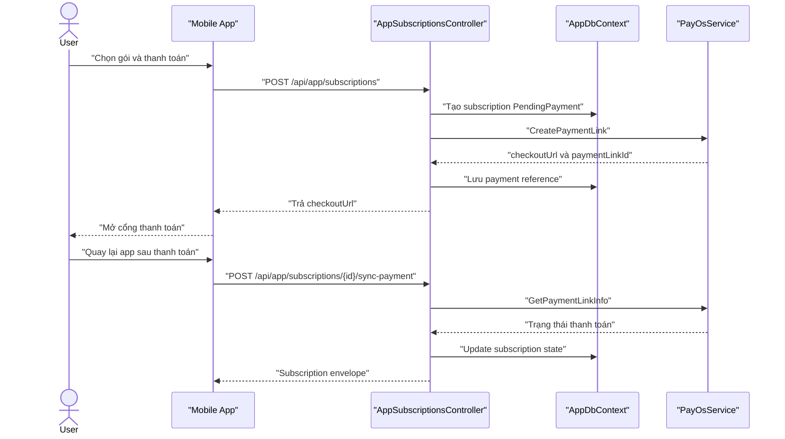
```mermaid
sequenceDiagram
    actor U as User
    participant M as "Mobile App"
    participant API as "AppSubscriptionsController"
    participant DB as "AppDbContext"
    participant PO as "PayOsService"

    U->>M: "Chọn gói và thanh toán"
    M->>API: "POST /api/app/subscriptions"
    API->>DB: "Tạo subscription PendingPayment"
    API->>PO: "CreatePaymentLink"
    PO-->>API: "checkoutUrl và paymentLinkId"
    API->>DB: "Lưu payment reference"
    API-->>M: "Trả checkoutUrl"
    M-->>U: "Mở cổng thanh toán"
    U->>M: "Quay lại app sau thanh toán"
    M->>API: "POST /api/app/subscriptions/{id}/sync-payment"
    API->>PO: "GetPaymentLinkInfo"
    PO-->>API: "Trạng thái thanh toán"
    API->>DB: "Update subscription state"
    API-->>M: "Subscription envelope"
```

### Activity Diagram
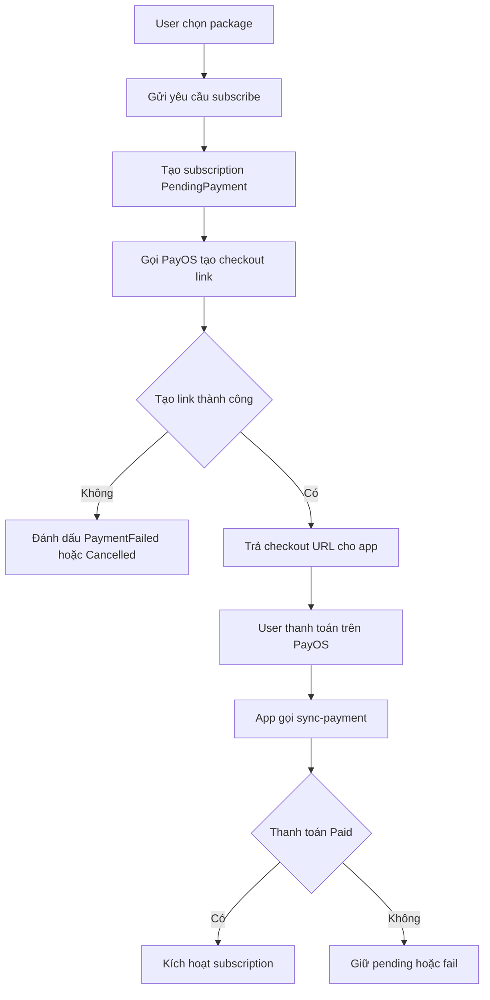
```mermaid
flowchart TD
    A["User chọn package"] --> B["Gửi yêu cầu subscribe"]
    B --> C["Tạo subscription PendingPayment"]
    C --> D["Gọi PayOS tạo checkout link"]
    D --> E{"Tạo link thành công"}
    E -- "Không" --> F["Đánh dấu PaymentFailed hoặc Cancelled"]
    E -- "Có" --> G["Trả checkout URL cho app"]
    G --> H["User thanh toán trên PayOS"]
    H --> I["App gọi sync-payment"]
    I --> J{"Thanh toán Paid"}
    J -- "Có" --> K["Kích hoạt subscription"]
    J -- "Không" --> L["Giữ pending hoặc fail"]
```

---

## UC06 - AI Tour Plan và Chatbot Thổ Địa

### Use Case Specification
- Mã use case: UC06
- Tác nhân chính: User gói Tour Plus
- Mục tiêu: Nhận lịch trình AI và chat tư vấn món ăn
- Tiền điều kiện: User có quyền `AllowAiPlan` hoặc `AllowChatbot`
- Hậu điều kiện: Trả về nội dung AI hoặc fallback deterministic
- Luồng chính:
  1. App gọi `POST /api/ai/tour-plan` hoặc `/chatbot`
  2. Backend check subscription access
  3. Backend build context từ DB
  4. Backend gọi Groq API
  5. Trả nội dung cho app
- Luồng thay thế:
  - Không đủ quyền -> 403
  - Groq lỗi -> fallback nội dung có cấu trúc

### Sequence Diagram
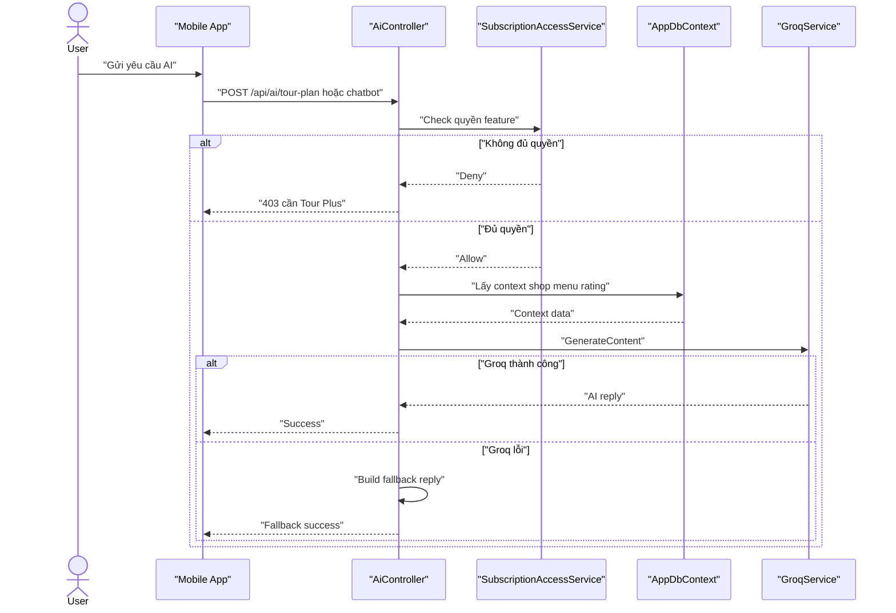
```mermaid
sequenceDiagram
    actor U as User
    participant M as "Mobile App"
    participant API as "AiController"
    participant SUB as "SubscriptionAccessService"
    participant DB as "AppDbContext"
    participant AI as "GroqService"

    U->>M: "Gửi yêu cầu AI"
    M->>API: "POST /api/ai/tour-plan hoặc chatbot"
    API->>SUB: "Check quyền feature"
    alt "Không đủ quyền"
        SUB-->>API: "Deny"
        API-->>M: "403 cần Tour Plus"
    else "Đủ quyền"
        SUB-->>API: "Allow"
        API->>DB: "Lấy context shop menu rating"
        DB-->>API: "Context data"
        API->>AI: "GenerateContent"
        alt "Groq thành công"
            AI-->>API: "AI reply"
            API-->>M: "Success"
        else "Groq lỗi"
            API->>API: "Build fallback reply"
            API-->>M: "Fallback success"
        end
    end
```

### Activity Diagram
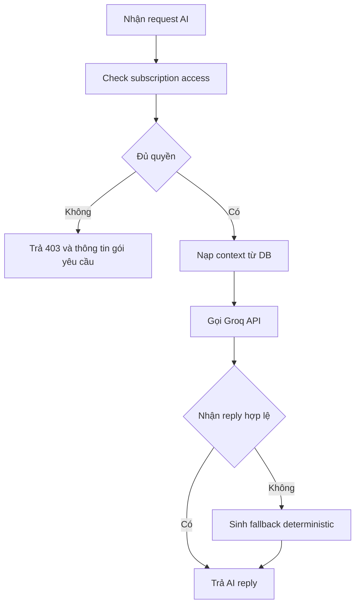
```mermaid
flowchart TD
    A["Nhận request AI"] --> B["Check subscription access"]
    B --> C{"Đủ quyền"}
    C -- "Không" --> D["Trả 403 và thông tin gói yêu cầu"]
    C -- "Có" --> E["Nạp context từ DB"]
    E --> F["Gọi Groq API"]
    F --> G{"Nhận reply hợp lệ"}
    G -- "Có" --> H["Trả AI reply"]
    G -- "Không" --> I["Sinh fallback deterministic"]
    I --> H
```

---

## UC07 - Tinder quán ăn và lưu lịch sử swipe

### Use Case Specification
- Mã use case: UC07
- Tác nhân chính: User
- Mục tiêu: Swipe quán ăn để tạo danh sách yêu thích
- Tiền điều kiện: User đã đăng nhập và có quyền tinder
- Hậu điều kiện: Dữ liệu swipe lưu trong `SwipedItem`
- Luồng chính:
  1. App gọi `GET /api/app/tinder/cards`
  2. User swipe trái hoặc phải
  3. App gọi `POST /api/app/tinder/swipe`
  4. Backend lưu hoặc cập nhật bản ghi unique `(UserId, ShopId)`
  5. App gọi `GET /api/app/tinder/liked` khi cần

### Sequence Diagram
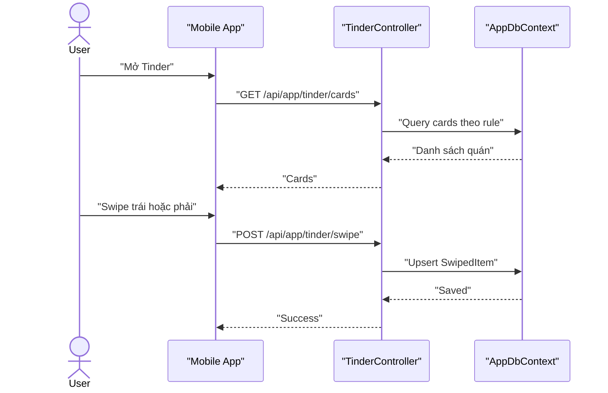
```mermaid
sequenceDiagram
    actor U as User
    participant M as "Mobile App"
    participant API as "TinderController"
    participant DB as "AppDbContext"

    U->>M: "Mở Tinder"
    M->>API: "GET /api/app/tinder/cards"
    API->>DB: "Query cards theo rule"
    DB-->>API: "Danh sách quán"
    API-->>M: "Cards"
    U->>M: "Swipe trái hoặc phải"
    M->>API: "POST /api/app/tinder/swipe"
    API->>DB: "Upsert SwipedItem"
    DB-->>API: "Saved"
    API-->>M: "Success"
```

### Activity Diagram
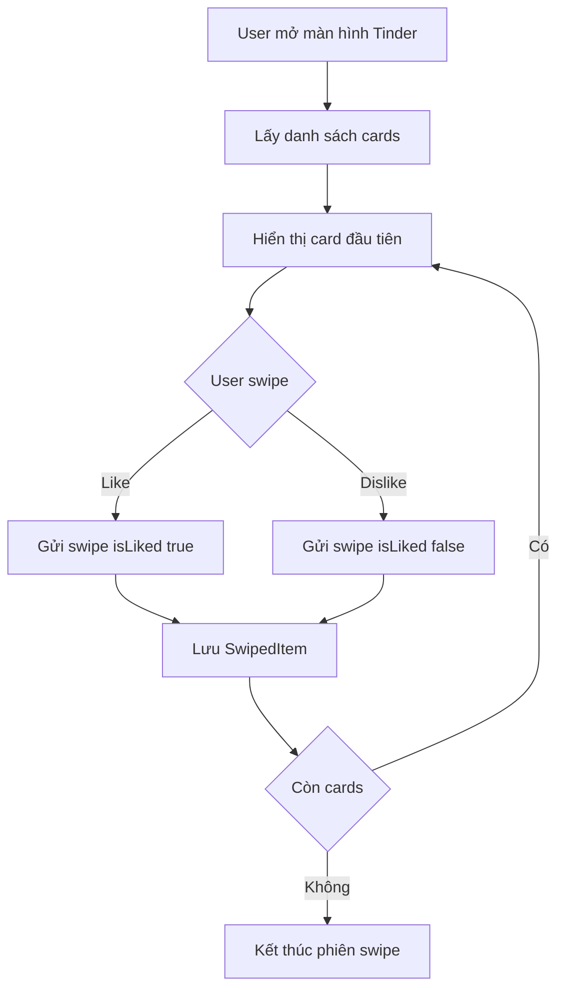
```mermaid
flowchart TD
    A["User mở màn hình Tinder"] --> B["Lấy danh sách cards"]
    B --> C["Hiển thị card đầu tiên"]
    C --> D{"User swipe"}
    D -- "Like" --> E["Gửi swipe isLiked true"]
    D -- "Dislike" --> F["Gửi swipe isLiked false"]
    E --> G["Lưu SwipedItem"]
    F --> G
    G --> H{"Còn cards"}
    H -- "Có" --> C
    H -- "Không" --> I["Kết thúc phiên swipe"]
```

---

## UC08 - Owner quản lý shop menu và tạo TTS

### Use Case Specification
- Mã use case: UC08
- Tác nhân chính: Owner
- Mục tiêu: Quản lý gian hàng, menu, dịch và tạo audio TTS
- Tiền điều kiện: Owner đã đăng nhập, có subscription owner phù hợp
- Hậu điều kiện: Shop/menu cập nhật, audio URL mới được lưu
- Luồng chính:
  1. Owner tạo shop qua `POST /api/owner/shops`
  2. Backend tạo POI và translation vi mặc định
  3. Owner tạo hoặc sửa menu
  4. Owner gọi generate TTS một ngôn ngữ hoặc all
  5. Backend lưu `AudioUrl` vào `POITranslation`

### Sequence Diagram
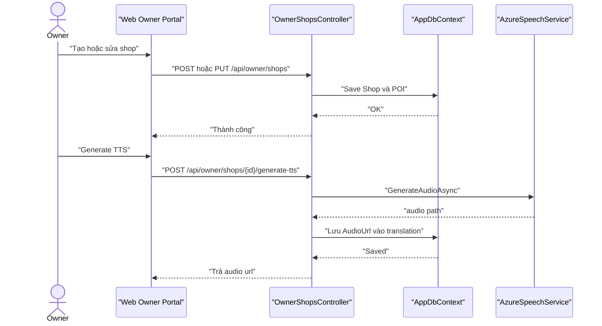
```mermaid
sequenceDiagram
    actor O as Owner
    participant W as "Web Owner Portal"
    participant API as "OwnerShopsController"
    participant DB as "AppDbContext"
    participant TTS as "AzureSpeechService"

    O->>W: "Tạo hoặc sửa shop"
    W->>API: "POST hoặc PUT /api/owner/shops"
    API->>DB: "Save Shop và POI"
    DB-->>API: "OK"
    API-->>W: "Thành công"
    O->>W: "Generate TTS"
    W->>API: "POST /api/owner/shops/{id}/generate-tts"
    API->>TTS: "GenerateAudioAsync"
    TTS-->>API: "audio path"
    API->>DB: "Lưu AudioUrl vào translation"
    DB-->>API: "Saved"
    API-->>W: "Trả audio url"
```

### Activity Diagram
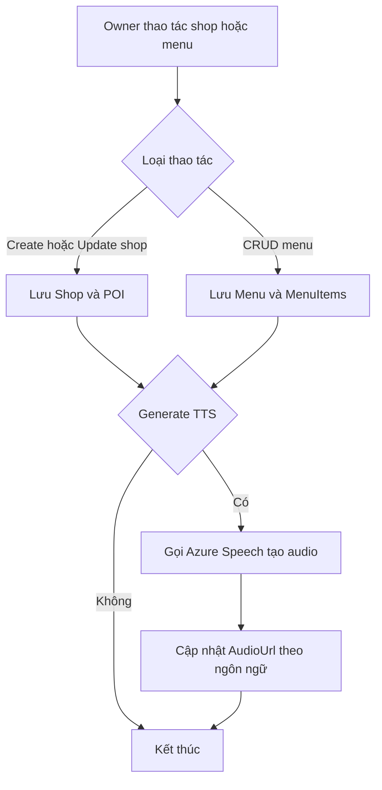
```mermaid
flowchart TD
    A["Owner thao tác shop hoặc menu"] --> B{"Loại thao tác"}
    B -- "Create hoặc Update shop" --> C["Lưu Shop và POI"]
    B -- "CRUD menu" --> D["Lưu Menu và MenuItems"]
    C --> E{"Generate TTS"}
    D --> E
    E -- "Có" --> F["Gọi Azure Speech tạo audio"]
    F --> G["Cập nhật AudioUrl theo ngôn ngữ"]
    E -- "Không" --> H["Kết thúc"]
    G --> H
```

---

## UC09 - Admin quản trị dữ liệu hệ thống

### Use Case Specification
- Mã use case: UC09
- Tác nhân chính: Admin
- Mục tiêu: Quản lý user, seller, store, POI, category, language, packages
- Tiền điều kiện: Admin đã đăng nhập
- Hậu điều kiện: Dữ liệu hệ thống được cập nhật theo thao tác
- Luồng chính:
  1. Admin vào portal
  2. Gọi các API nhóm `api/admin/*`
  3. Backend xác thực role ADMIN
  4. DB cập nhật dữ liệu
  5. Portal reload danh sách và thống kê

### Sequence Diagram
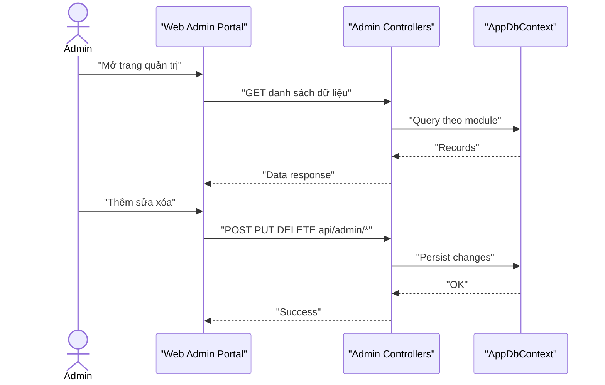
```mermaid
sequenceDiagram
    actor A as Admin
    participant W as "Web Admin Portal"
    participant API as "Admin Controllers"
    participant DB as "AppDbContext"

    A->>W: "Mở trang quản trị"
    W->>API: "GET danh sách dữ liệu"
    API->>DB: "Query theo module"
    DB-->>API: "Records"
    API-->>W: "Data response"
    A->>W: "Thêm sửa xóa"
    W->>API: "POST PUT DELETE api/admin/*"
    API->>DB: "Persist changes"
    DB-->>API: "OK"
    API-->>W: "Success"
```

### Activity Diagram
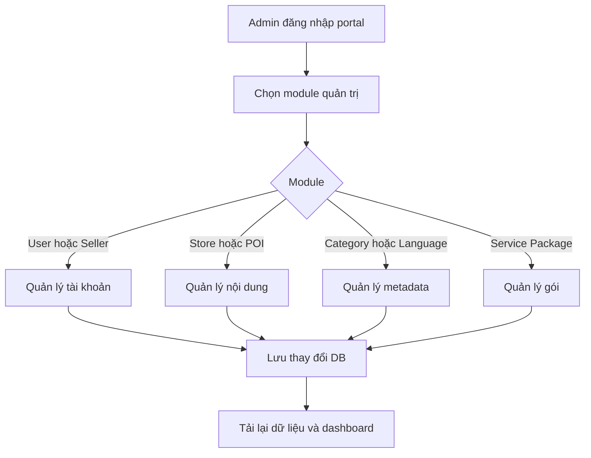
```mermaid
flowchart TD
    A["Admin đăng nhập portal"] --> B["Chọn module quản trị"]
    B --> C{"Module"}
    C -- "User hoặc Seller" --> D["Quản lý tài khoản"]
    C -- "Store hoặc POI" --> E["Quản lý nội dung"]
    C -- "Category hoặc Language" --> F["Quản lý metadata"]
    C -- "Service Package" --> G["Quản lý gói"]
    D --> H["Lưu thay đổi DB"]
    E --> H
    F --> H
    G --> H
    H --> I["Tải lại dữ liệu và dashboard"]
```

---

## UC10 - Webhook PayOS và đồng bộ trạng thái thanh toán

### Use Case Specification
- Mã use case: UC10
- Tác nhân chính: PayOS webhook server
- Mục tiêu: Cập nhật trạng thái subscription theo giao dịch thực tế
- Tiền điều kiện: Subscription có `PaymentOrderCode` hoặc `PaymentLinkId`
- Hậu điều kiện: Subscription status payment status đồng bộ đúng
- Luồng chính:
  1. PayOS gọi webhook `POST /api/payments/payos/webhook`
  2. Backend verify signature
  3. Backend tìm subscription liên quan
  4. Backend áp dụng trạng thái paid failed cancelled
  5. Client có thể sync lại để nhận trạng thái mới

### Sequence Diagram
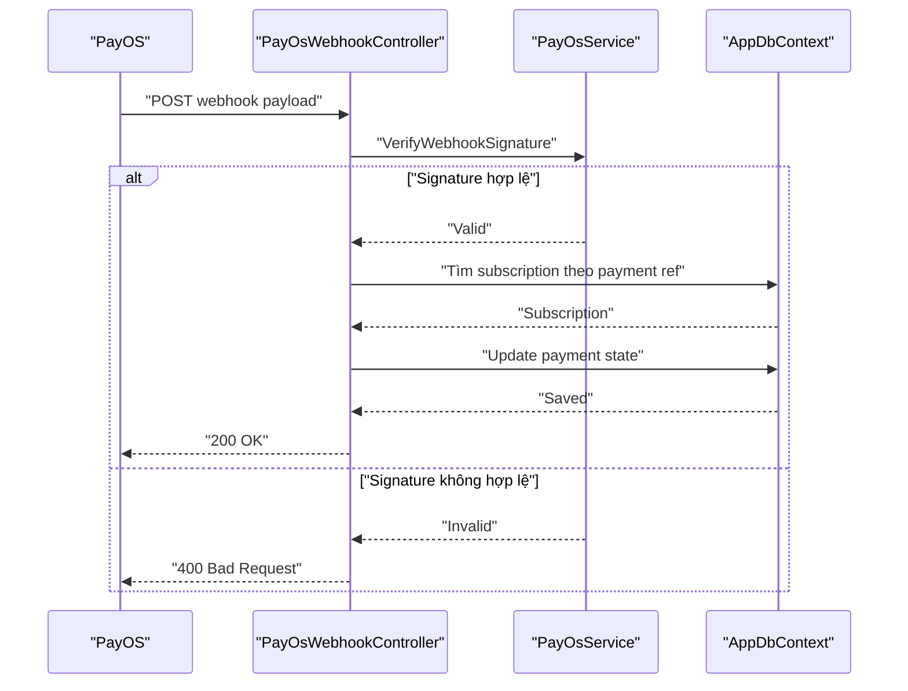
```mermaid
sequenceDiagram
    participant P as "PayOS"
    participant WH as "PayOsWebhookController"
    participant PS as "PayOsService"
    participant DB as "AppDbContext"

    P->>WH: "POST webhook payload"
    WH->>PS: "VerifyWebhookSignature"
    alt "Signature hợp lệ"
        PS-->>WH: "Valid"
        WH->>DB: "Tìm subscription theo payment ref"
        DB-->>WH: "Subscription"
        WH->>DB: "Update payment state"
        DB-->>WH: "Saved"
        WH-->>P: "200 OK"
    else "Signature không hợp lệ"
        PS-->>WH: "Invalid"
        WH-->>P: "400 Bad Request"
    end
```

### Activity Diagram
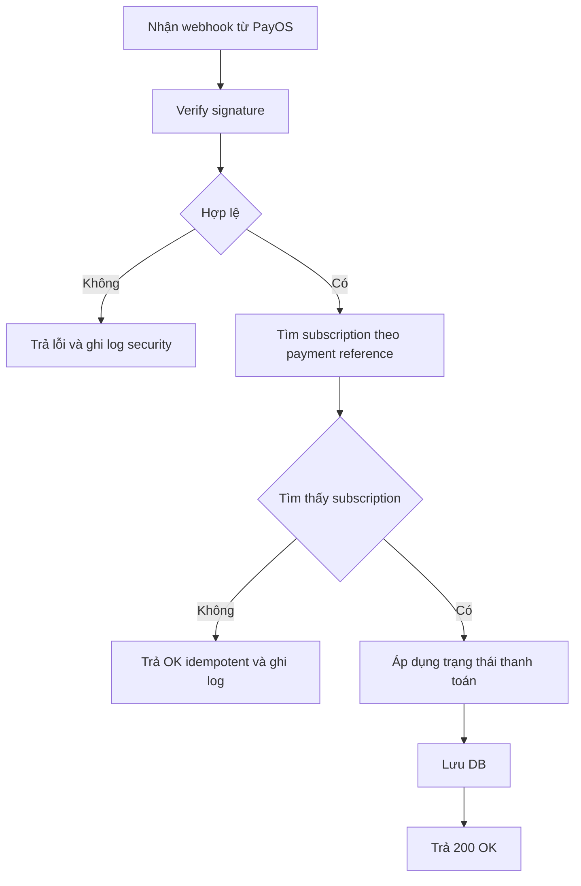
```mermaid
flowchart TD
    A["Nhận webhook từ PayOS"] --> B["Verify signature"]
    B --> C{"Hợp lệ"}
    C -- "Không" --> D["Trả lỗi và ghi log security"]
    C -- "Có" --> E["Tìm subscription theo payment reference"]
    E --> F{"Tìm thấy subscription"}
    F -- "Không" --> G["Trả OK idempotent và ghi log"]
    F -- "Có" --> H["Áp dụng trạng thái thanh toán"]
    H --> I["Lưu DB"]
    I --> J["Trả 200 OK"]
```

---

## UC11 - Theo dõi online users realtime bằng SignalR

### Use Case Specification
- Mã use case: UC11
- Tác nhân chính: User app, Admin dashboard
- Mục tiêu: Hiển thị danh sách online users realtime
- Tiền điều kiện: Hub hoạt động
- Hậu điều kiện: Admin thấy số user online cập nhật theo thời gian thực
- Luồng chính:
  1. User login và mobile connect hub
  2. Hub ghi nhận connection
  3. Hub broadcast `OnlineUsersUpdated`
  4. Admin page online users nhận event và render UI

### Sequence Diagram
```mermaid
sequenceDiagram
    participant U as "Mobile User"
    participant S as "SignalRService"
    participant H as "UserTrackerHub"
    participant T as "UserTrackerService"
    participant A as "Admin OnlineUsers Page"

    U->>S: "Login thành công"
    S->>H: "Connect with JWT"
    H->>T: "AddOrUpdateConnection"
    T-->>H: "Online users list"
    H-->>A: "OnlineUsersUpdated"
    A-->>A: "Render bảng realtime"
    U->>S: "Logout hoặc mất kết nối"
    S->>H: "Disconnect"
    H->>T: "RemoveConnection"
    H-->>A: "OnlineUsersUpdated"
```

### Activity Diagram
```mermaid
flowchart TD
    A["User app đăng nhập"] --> B["Connect SignalR hub"]
    B --> C["Hub thêm connection vào tracker"]
    C --> D["Broadcast danh sách online users"]
    D --> E["Admin dashboard nhận event"]
    E --> F["Cập nhật UI realtime"]
    F --> G{"User disconnect"}
    G -- "Có" --> H["Hub xóa connection và broadcast lại"]
    H --> E
    G -- "Không" --> F
```

---

## UC12 - Đăng ký tài khoản người dùng mới

### Use Case Specification
- Mã use case: UC12
- Tác nhân chính: Guest
- Mục tiêu: Tạo tài khoản USER từ app
- Tiền điều kiện: Email chưa tồn tại
- Hậu điều kiện: User mới được tạo với role USER
- Luồng chính:
  1. Guest nhập thông tin đăng ký
  2. App gọi `POST /api/auth/register-user`
  3. Backend kiểm tra trùng email
  4. Backend hash mật khẩu BCrypt
  5. Backend lưu user với role USER

### Sequence Diagram
```mermaid
sequenceDiagram
    actor G as Guest
    participant M as "Mobile App"
    participant API as "AuthController"
    participant DB as "AppDbContext"

    G->>M: "Nhập email password fullname"
    M->>API: "POST /api/auth/register-user"
    API->>DB: "Check email tồn tại"
    alt "Email đã tồn tại"
        DB-->>API: "Exists"
        API-->>M: "400 Bad Request"
    else "Email hợp lệ"
        API->>API: "Hash password BCrypt"
        API->>DB: "Insert user role USER"
        DB-->>API: "Saved"
        API-->>M: "Đăng ký thành công"
    end
```

### Activity Diagram
```mermaid
flowchart TD
    A["Guest nhập form đăng ký"] --> B["Gửi request register-user"]
    B --> C["Kiểm tra email trùng"]
    C --> D{"Email đã tồn tại"}
    D -- "Có" --> E["Trả lỗi trùng email"]
    D -- "Không" --> F["Hash mật khẩu"]
    F --> G["Gán role USER"]
    G --> H["Lưu user vào DB"]
    H --> I["Trả thành công"]
```

---

## Hướng dẫn chèn vào thuyết minh đồ án

- Chèn phần Use Case specification vào chương phân tích hệ thống.
- Chèn các block Mermaid vào công cụ render (Mermaid Live Editor, Markdown preview, hoặc draw.io plugin) để xuất PNG/SVG.
- Đặt tên hình theo chuẩn báo cáo:
  - Hình 3.x: Use Case Diagram
  - Hình 4.x: Sequence Diagram
  - Hình 5.x: Activity Diagram
- Nếu cần đúng format Word, xuất từng hình PNG rồi chèn vào file `Thuyet_Minh_Do_An_FoodStreet.updated.v2.docx`.
